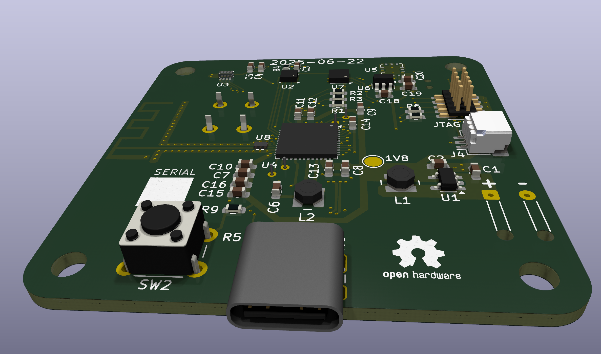

# Housens

Project to make my own low-power house sensors.

Current iteration (r002):

- Bluetooth
- ambient light (OPT3005)
- pressure, humidity, temperature (BME280)
- carbon dioxide (STCC4)
- STM32WG core
- powered from CR2032
- 50x50mm

Hardware licensed [CC-BY-SA 4.0](https://creativecommons.org/licenses/by-sa/4.0/).

Firmware licensed [GPL-3.0-or-later](https://opensource.org/license/gpl-3-0).

## Renders

